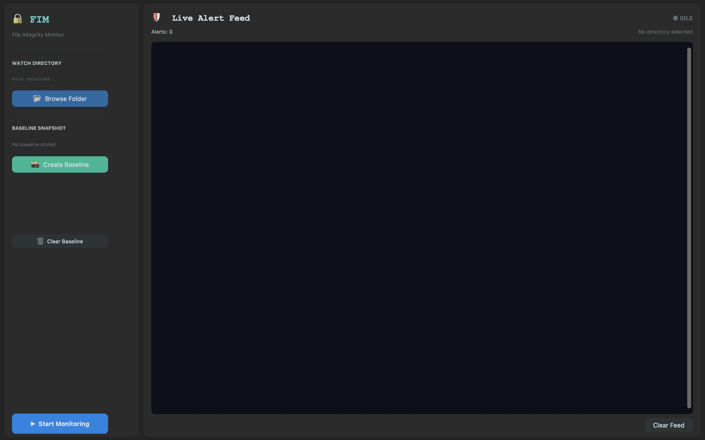
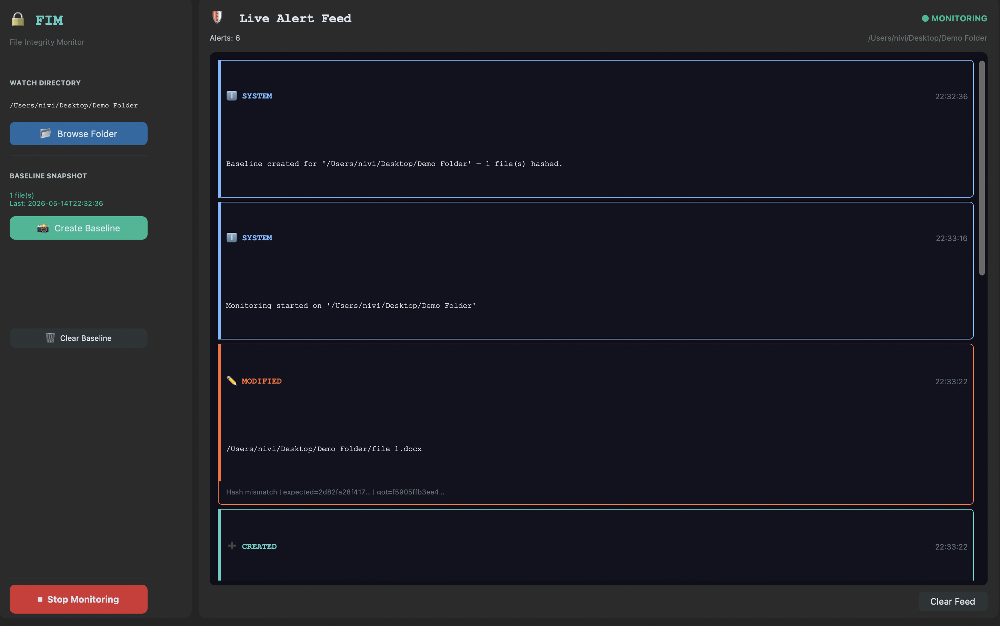
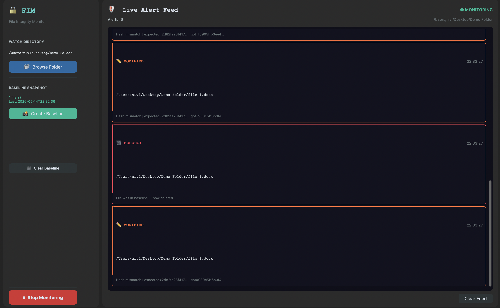
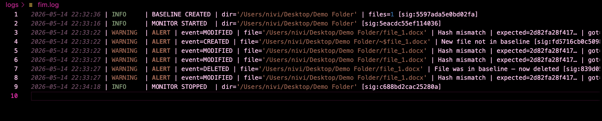

# 🔒 File Integrity Monitor (FIM)

A desktop cybersecurity tool that watches files for unauthorized changes using SHA-256 hashing and real-time filesystem monitoring.

Built with Python, Watchdog, SQLite, and CustomTkinter.

---

## Features

- **SHA-256 baseline snapshots** stored in SQLite
- **Real-time watchdog monitoring** — detects create / modify / delete / move events instantly
- **Tamper-evident logging** — each log line is HMAC-signed
- **Modern CustomTkinter UI** — dark-themed dashboard with color-coded alert feed
- **Thread-safe** — monitoring runs in background threads, UI stays responsive

---

# 🚀 Quick Start

## 1. Clone the repository

```bash
git clone https://github.com/your-username/file-integrity-monitor.git
cd file-integrity-monitor
```

## 2. Create virtual environment

```bash
python3 -m venv venv
source venv/bin/activate
```

## 3. Install dependencies

```bash
pip install -r requirements.txt
```

## 4. Run the application

```bash
python main.py
```

---

# 🖥️ Usage Workflow

1. Click **Browse Folder**
2. Select a directory to protect
3. Click **Create Baseline**
4. Start monitoring with **Start Monitoring**
5. Modify/create/delete files inside the folder
6. Observe real-time alerts in the dashboard
7. Click **Stop Monitoring** when finished

---

# 📂 Project Structure

```text
file-integrity-monitor/
│
├── main.py                  # Application entry point
│
├── core/
│   ├── hasher.py            # SHA-256 hashing utilities
│   ├── monitor.py           # Watchdog observer + event handler
│   ├── database.py          # SQLite baseline management
│   └── logger.py            # HMAC-signed tamper-evident logs
│
├── ui/
│   ├── app.py               # Main CustomTkinter application
│   ├── dashboard.py         # Live monitoring dashboard
│   └── settings.py          # Folder selection + controls
│
├── logs/
│   └── fim.log              # Auto-generated runtime logs
│
├── data/
│   └── baseline.db          # Auto-generated SQLite database
│
├── demo_images/             # README screenshots
│
├── requirements.txt
├── .gitignore
└── README.md
```

---

# 🚨 Alert Types

| Icon | Alert Type | Description |
|------|-------------|-------------|
| ✏️ | MODIFIED | File hash differs from baseline |
| ➕ | CREATED | New file detected |
| 🗑️ | DELETED | Baseline file removed |
| 📦 | MOVED | File renamed or moved |
| ⚠️ | UNREADABLE | File exists but cannot be accessed |

---

# 🛠️ Tech Stack

| Layer | Technology |
|-------|-------------|
| Language | Python 3.11+ |
| UI Framework | CustomTkinter |
| File Monitoring | watchdog |
| Hashing | hashlib (SHA-256) |
| Database | SQLite3 |
| Logging | Python logging + HMAC |

---

# 🔐 Security Notes

- Each log line contains an **HMAC-SHA256 signature** generated using a session key.
- Any manual modification to log entries can be detected through signature mismatch.
- Baseline hashes are stored in SQLite for efficient verification.
- Designed for **intrusion detection**, not prevention.

---

# 📸 Demo Images

| Dashboard | Monitoring Active |
|------------|------------------|
|  |  |

| File Change Detection | Log File |
|----------------------|-------------|
|  |  |

---

# ⚠️ macOS Note

If you encounter:

```bash
ModuleNotFoundError: No module named '_tkinter'
```

Install Python from the official Python website instead of Homebrew:

https://www.python.org/downloads/macos/

Then recreate the virtual environment.

---

# 📄 License

This project is intended for educational and cybersecurity learning purposes.